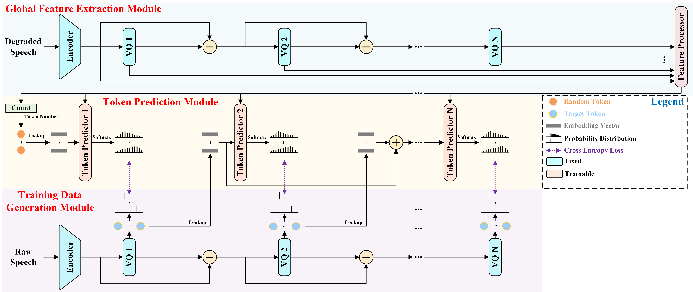
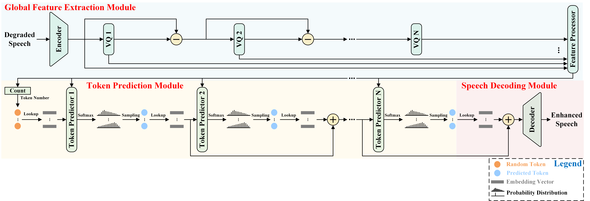

# Universal Discrete-Domain Speech Enhancement
### Fei Liu, Yang Ai, Ye-Xin Lu, Rui-Chen Zheng, Hui-Peng Du, Zhen-Hua Ling
#### Published in IEEE Transactions on Audio, Speech, and Language Processing
[](https://arxiv.org/abs/2510.09974)  

**Abstract:** 
In real-world scenarios, speech signals are inevitably corrupted by various types of interference, making speech enhancement (SE) a critical task for robust speech processing. 
However, most existing SE methods only handle a limited range of distortions, such as additive noise, reverberation, or band limitation, while the study of SE under multiple simultaneous distortions remains limited. 
This gap affects the generalization and practical usability of SE methods in real-world environments.
To address this gap, this paper proposes a novel Universal Discrete-domain SE model called UDSE. 
UDSE primarily works to enhance speech by predicting clean discrete tokens that are quantized by the residual vector quantizer (RVQ) of a pre-trained neural speech codec and are predicted in accordance with the RVQ rules. 
Specifically, UDSE first extracts global features from the degraded speech. Guided by these global features, the clean token prediction for each VQ follows the rules of RVQ, where the prediction of each VQ relies on the results of the preceding ones. 
Finally, the predicted clean tokens from all VQs are decoded to reconstruct the clean speech waveform. During training, the UDSE model employs a teacher-forcing strategy, and is optimized with cross-entropy loss. 
Experimental results confirm that the proposed UDSE model can effectively enhance speech degraded by various conventional and unconventional distortions, e.g., additive noise, reverberation, band limitation, clipping, phase distortion, and compression distortion, as well as their combinations. 
These results demonstrate the superior universality and practicality of UDSE compared to advanced regression-based SE methods.

**Audio samples can be found at the [demo website](https://fliu215.github.io/UDSE/).**

## Model Structure
### Train

### Inference

## Pre-requisites
1. Clone this repository.
2. Install requirements.
```
conda create -n udse python=3.9
conda activate udse
cd UDSE_Code
pip install -r requirements.txt
```
3. Download and extract the [VoiceBank+DEMAND dataset](https://datashare.ed.ac.uk/handle/10283/1942).Data processing instructions can be found in ```data_prepare```. Resample all wav files to 44.1 kHz.

## Training
```
CUDA_VISIBLE_DEVICES=0 python train.py
```

## Inference
```
CUDA_VISIBLE_DEVICES=0 python inference.py --test_noise_wav your/path --output_dir save/path
```

## Citation
```
@article{liu2025universal,
  title={Universal Discrete-Domain Speech Enhancement},
  author={Liu, Fei and Ai, Yang and Lu, Ye-Xin and Zheng, Rui-Chen and Du, Hui-Peng and Ling, Zhen-Hua},
  journal={IEEE Transactions on Audio, Speech and Language Processing},
  volume={34},
  pages={285--298},
  year={2025},
  publisher={IEEE}
}
```
